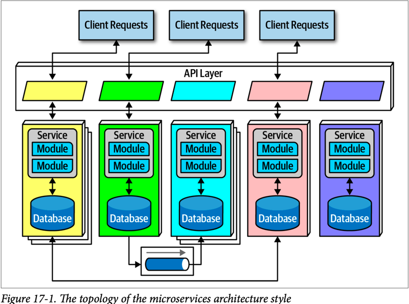
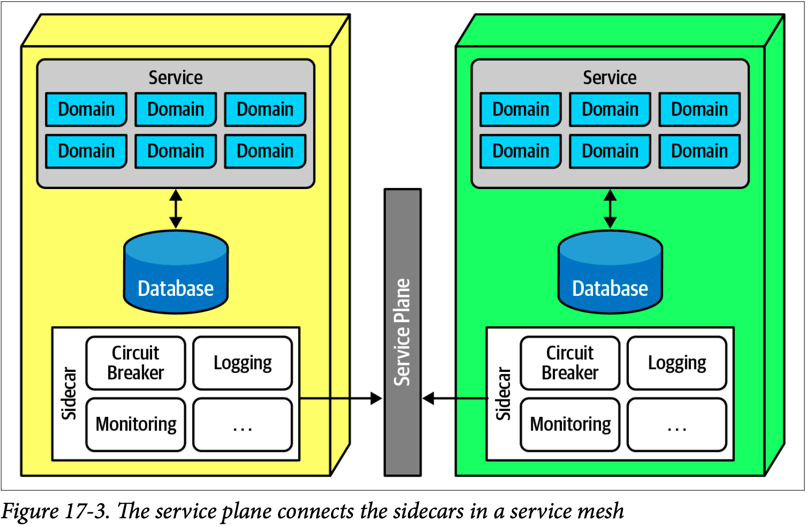
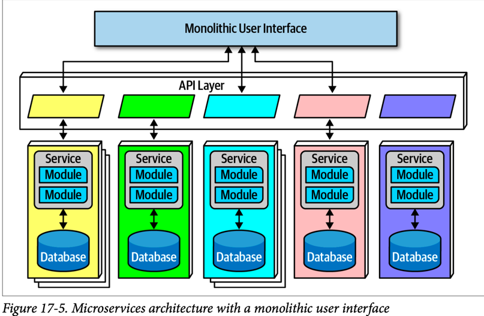
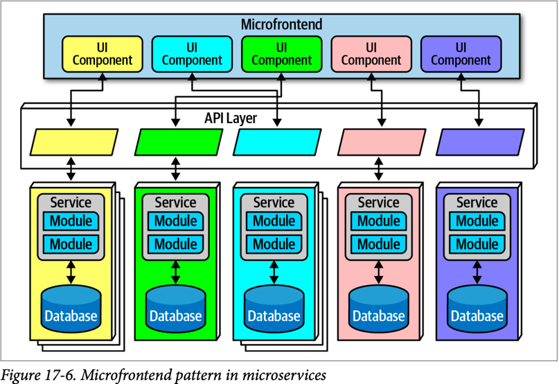

# Monolithic Versus Distributed Architectures

Architecture styles can be classified into two main types:
**_monolithic_** (Single deploy unit of all code) and _**distributed**_ (multiple deployment units connected through remote access protocols)

"Distributed architecture styles, while being much more powerful in terms of performance, scalability,
and availability than monolithic architecture styles, have significant trade-offs for this power."

All the issues of all distributed systems are described in **_the fallacies of distributed computing_**
that was first coined by L. Petter and other colleagues from Sun Microsystems in 1994.

## Fallacy #1: The Network Is Reliable


We usually assume that the network is reliable, but it's not. 
While networks have become more reliable over the time, the fact is the network is generally unreliable.
This is significant for all distributed architectures because its rely on the network for communication between services. 

As illustrated in Figure 9-2, `Service B` may be totally healthy, but `Service A` cannot reach it due to a network problem.
This is why things like timeouts and circuit breakers exist between services. 

`The more a system relies on the network, the potentially less reliable it becomes.`

___

## Fallacy #2: Latency is Zero 


"As Figure 9-3 shows, when a local call is made to another component via a method or
function call, that time (`t_local`) is measured in nanoseconds or microseconds.
However, when that same call is made through a remote access protocol (such as
REST, messaging, or RPC), the time measured to access that service (`t_remote`) is
measured in milliseconds. Therefore, `t_remote` will always be greater that `t_local`."

When using any distributed systems we must know the latency average given that it's the only way 
of determining whether a distributed architecture is feasible, particularly with `microservices` style
due to the fine-grained nature of the services and the amount of communications between those services.

`Knowing the average latency is important, but even more important is also knowing
the 95th to 99th percentile.`
___
## Fallacy #3: Bandwidth Is Infinite


"Bandwidth is usually not a concern in monolithic architectures, because once processing goes into a `monolith`,
little or no bandwidth is required to process that business request. 
However, as shown in Figure 9-4, once systems are broken apart into
smaller deployment units (services) in a distributed architecture such as `microservices`,
communication to and between these services significantly utilizes bandwidth,
causing network"

Let's say the in Figure 9-4, `Service A` perform an http call to `Service B` because `Service A` 
require a field that is part of the response of `Service B`. `Service B` returns 45 attributes totaling 500 kb 
but `Service A` only needs the one (200 bytes).

`This is a form of coupling referred to as stamp coupling`

This may not sound significant, but requests for `Service B` happen about 2,000 times a second.  
This means that this `Service B` call from `Service A` happens 2,000 times a second. At 500 kb for each request,
the amount of bandwidth used for that one _interservice_ call (out of hundreds being made that second) is **1 Gb**!

Stamp coupling can be resolved in the following ways:

- Create private RESTful API endpoints
- Use field selectors in the contract
- Use GraphQL to decouple contracts
- Use value-driven contracts with consumer-driven contracts (CDCs)
- Use internal messaging endpoints

```
ensuring that the minimal amount of data is passed between services or systems in a distributed architecture
is the best way to address this fallacy.
```
___

## Fallacy #4: The Network Is Secure


Most architects and developers get so comfortable using virtual private networks
(VPNs), trusted networks, and firewalls that they tend to forget about this fallacy of
distributed computing: the network is not secure.

As shown in Figure 9-5, each and every endpoint to each distributed deployment unit must be secured so that unknown or bad
equests do not make it to that service.
`The surface area for threats and attacks increases by magnitudes when moving from a monolithic to a distributed architecture.
`

Having to secure every endpoint, even when doing interservice communication,
is another reason performance tends to be slower in synchronous, highly-distributed architectures 
such as microservices or service-based architecture.
___
## Fallacy #5: The Topology Never Changes


This fallacy refers to the overall network topology, including all the routers, hubs, switches, firewalls, networks, 
and appliances used within the overall network. Architects assume that the topology is fixed and never changes.
`Of course, it changes.`

A change in network topology can invalidated all the latency assumptions, triggering timeouts and circuit breakers.
___
## Fallacy #6: There Is Only One Administrator


As shown in Figure 9-7, there are dozens of network administrators in a typical large company.
This fallacy points
to the complexity of distributed architecture and the amount of coordination that
must happen to get everything working correctly. _Monolithic applications do not
require this level of communication and collaboration due to the single deployment
unit characteristics of those architecture styles._
___
## Fallacy #7: Transport Cost Is Zero


Architects assume (incorrectly) that the necessary infrastructure is in place and sufficient for making a
simple RESTful call or breaking apart a monolithic application. 
_**It is usually not.**_ `Distributed architectures cost significantly more than monolithic architectures`, 
primarily due to increased needs for additional hardware, servers, gateways, firewalls, new subnets, proxies, and so on.

Whenever a distributed architecture is undertaken, we must analyze the current server and network topology 
with respect to capacity, bandwidth, latency, and security zones to avoid falling into the trap of surprise with this fallacy.
___

## Fallacy #8: The Network Is Homogeneous

The significance of this fallacy is regarding the network hardware and the possibility of incompatibility issues 
(Even though networking standards have evolved over the years, making this less of an issue,
the fact remains that not all situations). As such, network packets occasionally get lost. 
This in turn impacts network reliability (“Fallacy #1: The Network IsReliable”),
latency assumptions and assertions (“Fallacy #2: Latency IsZero”), 
and assumptions made about the bandwidth (“Fallacy #3: Bandwidth Is Infinite”). 

In other words, this fallacy ties back into all the other fallacies, 
forming an endless loop of confusion and frustration when dealing with networks (which is necessary when using distributed architectures)

## Microservices Architecture

### History
Microservices differs in this regard—it was named fairly early in its usage and popularized by a famous blog entry
by Martin Fowler and James Lewis entitled “Microservices,” published in March 2014.

Microservices is heavily inspired by the ideas in `domain-driven design (DDD)`,
One concept in particular from `DDD`, `bounded context`, decidedly inspired microservices.
The concept of bounded context represents a decoupling style

If the architect’s goal requires high degrees of decoupling, then they favor
duplication over reuse. The primary goal of microservices is high decoupling, physically modeling the logical 
notion of bounded context.

### Topology


Each service include all necessary parts to operate independently, including databases and other dependent components.

### Distributed

Microservices form a distributed architecture: each service runs in its own process,
which originally implied a physical computer but quickly evolved to virtual machines
and containers. 

Using a single server to manage multiple running applications allows operational reuse of
network bandwidth, memory, disk space, and a host of other benefits. However, if all the supported applications 
continue to grow, eventually some resource becomes constrained on the shared infrastructure. 
Another problem concerns improper isolation between shared applications.

**Performance is often the negative side effect of the distributed nature of microservices**. 
Network calls take much longer than method calls, and security verification at
every endpoint adds additional processing time,

The driving philosophy of microservices is the notion of bounded context: each ser‐
vice models a domain or workflow.
- In a monolith, it is common for developers to share common classes, such as Address, between disparate parts of the application
- Microservices try to avoid coupling, and thus an architect building this architecture style prefers duplication to coupling.

### Granularity
Architects struggle to find the correct granularity for services in microservices, and
often make the mistake of making their services too small, which requires them to
build communication links back between the services to do useful work.

```
The term “microservice” is a label, not a description.
    —Martin Fowler
```

Many developers take the term “microservices” as a commandment, not a description, and create services that are too fine-grained.

The purpose of service boundaries in microservices is to capture a domain or workflow.
In some applications, those natural boundaries might be large for some parts of the system—some business processes
are more coupled than others

### Data Isolation

Many other architecture styles use a single database for persistence.
However, microservices tries to avoid all kinds of coupling, including shared schemas and databases used as integration points

Data isolation is another factor an architect must consider when looking at service
granularity. Architects must be wary of the entity trap and not simply model their services to resemble single entities in a
database.

### Operational Reuse



Microservices prefers duplication to coupling, however there are parts of architecture that really do benefit from coupling,
such as operational concerns like monitoring, logging, and circuit breakers. 

Sidecar is like using a library that can be included at independent services, once an upgrade on the library is published (ServicePlane) 
the microservices can upgrade the library version allowing unified control across the architecture for concerns like logging and monitoring. 
The common sidecar components connect to form a consistent operational interface across all microservices


### Frontends


The monolithic frontend features a single user interface that calls through the API layer to satisfy user requests.
The frontend could be a rich desktop, mobile, or web application



This approach utilizes components at the user interface level to create a
synchronous level of granularity and isolation in the user interface as the backend
services. Each service emits the user interface for that service, which the frontend
coordinates with the other emitted user interface components. Using this pattern,
teams can isolate service boundaries from the user interface to the backend services,
unifying the entire domain within a single team.