# SQL vs NoSQL

# Relational Database
- Long history in enterprise organizations
- Structured
- Reliable
- Well-suited for most business transactions 
- Strict schema for data integrity

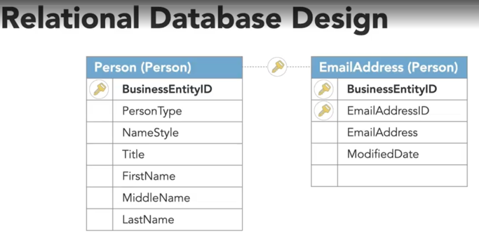
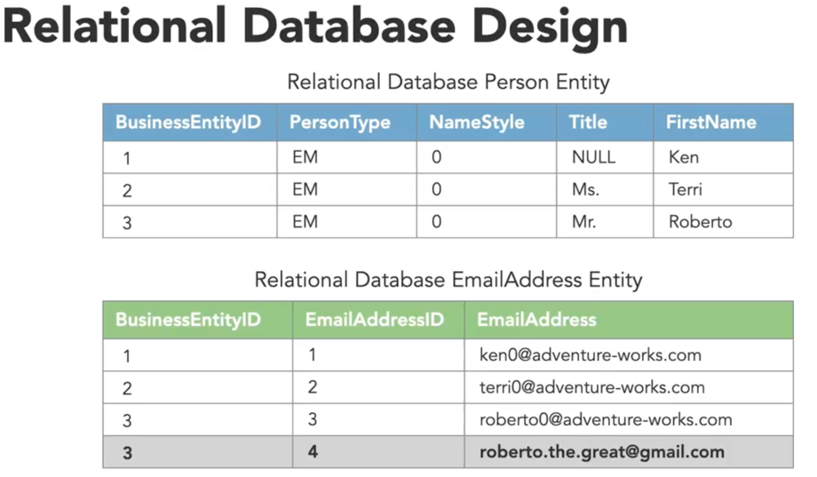

In relational databases, we need to specify all the columns for each record, even if it's not defined 
for the record in which case it  can be used NULL

### Relational databases are:
- Consistent
- Not highly available
- Not partition tolerant
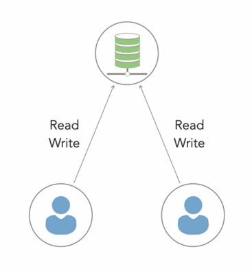

## Some databases:
- MySQL
- Oracle
- Microsoft SQL server
- SQLite
- Postgres
- MariaDB

# NoSQL
- Unstructured
- Distributed
- Dynamic schema
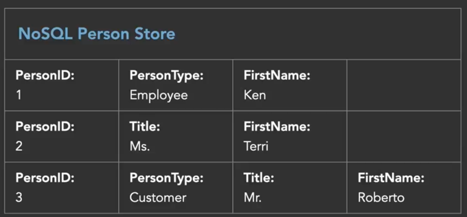

In NoSQL the columns do not need to be the same across rows.

## CAP Theorem

#### C: Consistency
- **Definition:** All nodes see same data at same time
- **Achieved by:**  Updating several nodes before allowing reads
#### A: Availability
- **Definition:** Every response gets a response either a success or a failure
- **Achieved by:** Replicating data across the different servers
#### P: Partition tolerance
- **Definition:** Systems continues to work despite message loss/partial failure.
Can sustain any amount of network failure without resulting in a failure of the entire network
- **Achieved by:** Data is sufficiently replicated across combination of nodes/networks to keep the system up.

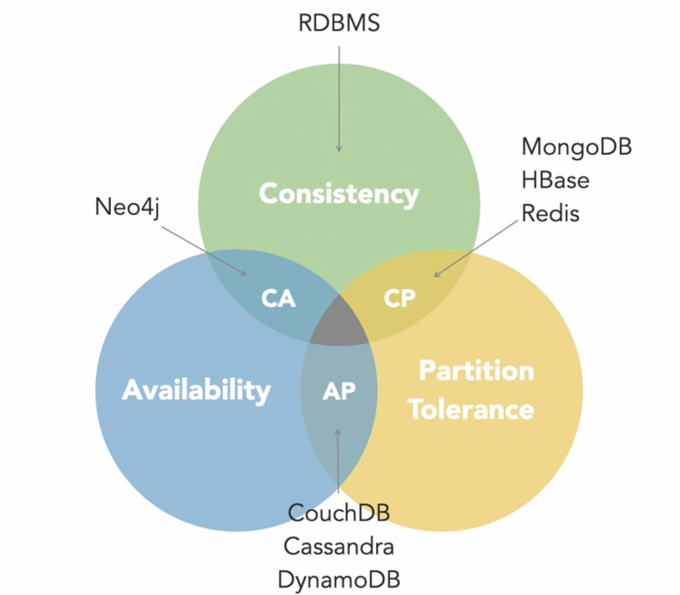
```
It's impossible for a distributed system to simultaneously provide more than two
of three of the above guarantees
```
We cannot build a datastore which is:
1. Continually available
2. Sequentially consistent 
3. partition failure tolerant

Because to be `consistent` all the nodes should see the same set of updates in the same order, but if network suffers 
`partition`, update in one partition might not make it to other partitions.

The client reads data from an out-of-date partition after having a read from an up-to-date partition

- **Solution:** Stop serving request from an out-of-date partition
- **Effect:** Service is no longer 100% available.

### NoSQL AP systems:
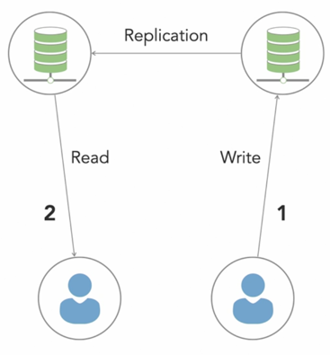

- Highly available
- Partition tolerance
- Imperfect, but eventual consistent
 
**examples**: Cassandra, DynamoDB, CouchDB

### NoSQL CP systems:
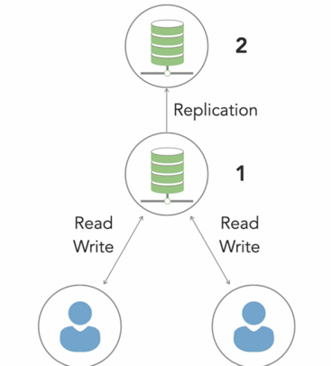

- Partition tolerant
- Consistent 
- Not highly available 

**examples**: MongoDB,HBase, Redis

## King of databases
### Key-value stores:
- Data is an array of key-value pair, Key in an attribute linked to a value.
- Simple data storage
- Useful for storing basic information like user profiles
- Highly scalable
- Useful for caching
- 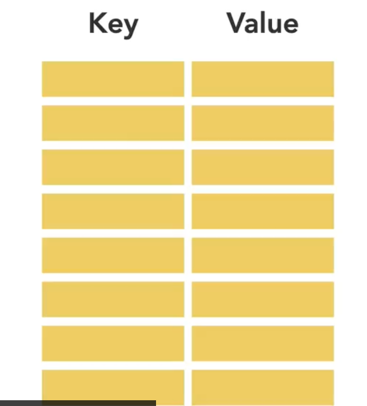
  
**examples:** Redis, Voldemart, DynamoDB.

### Document DB:
- Data as documents grouped into collections, each document can be different.
- Content management systems (CMSs), websites, large document storage without complex queries 
- Very similar to JSON
- Used in BigData
- 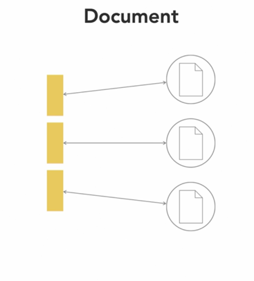

**examples:** CouchDB, MongoDB.

### Wide-column DB:
- Instead of tables, column families use container for rows.
- No need of knowing all columns upfront.
- Each row has different number of columns.
- Useful for analysis of large datasets, BigData, real-time analytics
- Subset of key-value
- Focus on your app's queries when modeling, not your app´s data
- 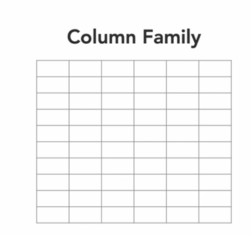

**examples:** Cassandra,HBase

### Graph DB:
- Different than other types of NoSQL data stores
- Store data in nodes that inherently show relationships via edges.
- Best used for relationship-types analysis
- Useful for social networks 
- 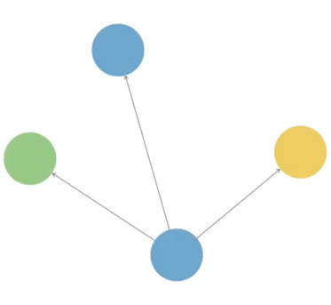

**examples:** Neo4J, InfiniteGraph

## High level of differences between SQL and NoSQL 

| Property      | SQL                                                                                                                                              | NoSQL                                                                                                                 |
|---------------|--------------------------------------------------------------------------------------------------------------------------------------------------|-----------------------------------------------------------------------------------------------------------------------|
| **Storage**   | Tables (Row -> Entity, Column -> Data point) <br> e.g. Student (Branch, ID, Name)                                                                | Diff. data storage models. <br> (Key-value, document, graph, columnar)                                                |
| **Schema**    | Fixed Schema (Columns must be decided & chosen before data entry) <br> Can be altered -> modify whole database <br> (Need to go offline)          | Dynamic Schemas. <br> Columns added on the fly. <br> Not mandatory for each row to contain data.                      |
| **Querying**  | SQL                                                                                                                                              | UnQL (Unstructured query language). <br> Queries focused on collection of documents. <br> Diff. DB => diff UnQL.      |
| **Scalability**| Vertically scalable (+ horsepower of hardware). <br> Expensive <br> Possible to scale across multiple servers -> challenging & time-consuming.   | Horizontally scalable. <br> Easy addition of servers. <br> Hosted on cloud or cheap commodity hardware. <br> Cost-effective. |
| **Reliability or ACID Compliancy** | ACID* Compliant <br> -> Data reliability <br> -> Guarantee of transactions <br> -> Still a better bet. | Sacrifices ACID Compliance for scalability & performance. <br> *(ACID - Atomicity, Consistency, Isolation, Durability)* |

## Reasons to use SQL DB

- You need to ensure ACID compliance:
  - ACID compliance reduce the anomalies and protect the integrity of the database, for many e-commerce and financial apps
  ACID compliant database is the first choice.
- Your data is structured unchanging 
  - If your business is not experiencing rapid growth or sudden changes and there is not requirements of more servers, and 
    data consistency is required, then there is no reason to use a system design to support variety of data and high traffic.

## Reasons to use NoSQL DB

When all other components of system are fast and querying and searching for data cause an bottleneck, NoSQL prevent data from
being bottleneck. For this reason NoSQL have been successful for BigData

1. To store large volumes of data (little/no structure)
   - No limit on type of data.
   - For example, Document DB stores all data in one place, no need of type of data.
2. Using cloud and storage to the fullest 
   Excellent cost saving solution, easy spread of data across multiple servers to scale up.
   NoSQL DB as Cassandra are designed to scale across multiple data centers out of the box
3. Useful for rapid/agile development 
   If you require quick iterations on schema SQL will slow you down.

### Vector Databases (NoSQL or NewSQl)

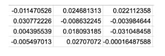

Vector databases handle data differently than traditional databases. A vector database manages data in a format known as vectors,
which are arrays of numbers that represent data points in a high-dimensional space. 
These vectors are typically generated by machine learning models and represent complex data such as images, 
text, and sounds in a way that machines can understand and process.

Given the complexity of data in AI, vector databases have gained popularity by excelling at storing and retrieving data 
by distance or similarity. This is crucial for efficiently performing tasks such as searching for similar images,
recommending products, or even detecting anomalies.

### benefits of vector databases
- Efficiency in similarity search.
- Support for complex data types.
- AI integration
- Useful for semantic search, recommendation systems, image search, personalization systems, among others.

**examples:** Qdrants, weaviate, pinecone, MongoDB/Atlas vector search, trychroma, Redis/vector search.


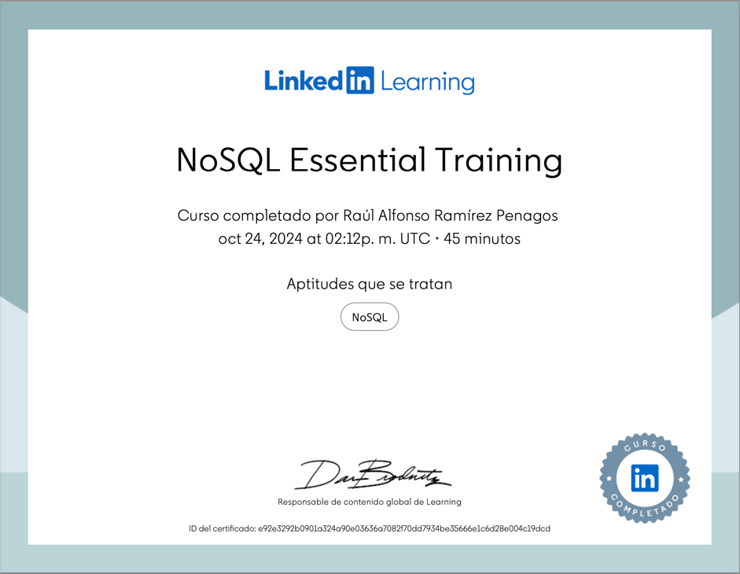