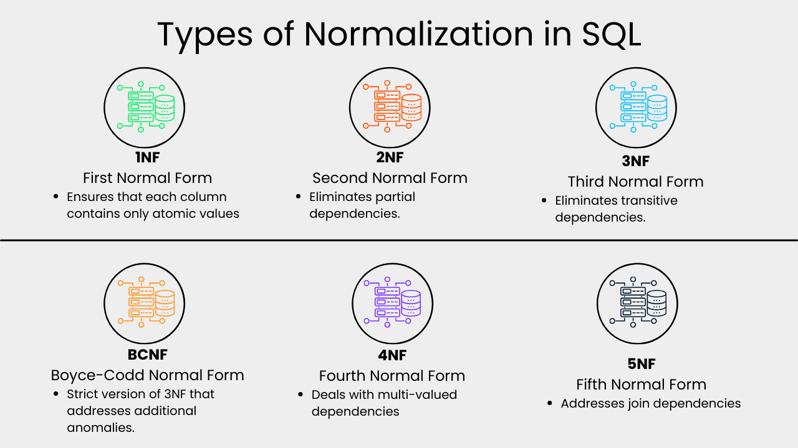
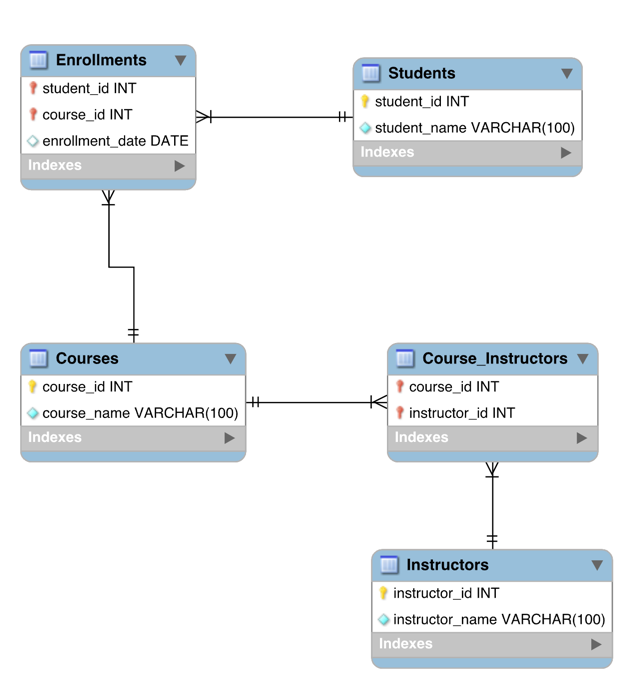

# Normalization in SQL

Normalization is a process used in relational databases to minimize redundancy and dependency by organizing fields and table relationships. 
The goal is to structure a database to reduce redundancy (duplicate data) and ensure data integrity.

It is widely used in SQL databases, which are based on a relational model, meaning data is stored in tables (relations)
, and the relationships between the data are important.

Normalization plays a crucial role in database design. Here are several reasons why it’s essential:

**Reduces redundancy:** Redundancy happens when the same information is stored multiple times, one way to avoid this is by splitting the data in small tables.

**Improves query performance:** You can improve the query execution performance by applying normalization getting as a result smaller tables 

**Minimizes update anomalies:** With a normalized database, you can perform updates on the required tables without affecting other records

**Enhances data integrity:** Ensures that data remains consistent and accurate.

###  Why NoSQL Databases Don't Use Normalization?

`NoSQL` databases such as `MongoDB`, `Cassandra`, and `Couchbase` are built for managing massive amounts of unstructured or semi-structured data.
They adhere to a model that is not relational, storing data in a flexible manner, typically using key-value pairs, documents, or graphs.

Normalizing data in NoSQL databases is typically not needed due to the following factors:

- NoSQL databases offer flexibility with schema, allowing data to be stored in different formats without requiring normalization.

- Optimizing performance: NoSQL databases focus on speed and scalability rather than strict data integrity. 
Duplication is frequently accepted or even promoted in order to guarantee excellent results.

- Data locality in NoSQL systems involves storing related data together,
as opposed to SQL databases which often scatter related data across various tables for normalization purposes.

## Different Types of Database Normalization

### First Normal Form (1NF)
This normalization level ensures that each column in your data contains only atomic values.
Atomic values in this context means that each entry in a column is indivisible.
1NF ensures atomicity of data, with each column cell containing only a single value and each column having unique names.

### Second Normal Form (2NF)
Eliminates partial dependencies by ensuring that non-key attributes depend only on the primary key.
What this means, in essence, is that there should be a direct relationship between each column and the primary key, and not between other columns.

### Third Normal Form (3NF)
Removes transitive dependencies by ensuring that non-key attributes depend only on the primary key.
This level of normalization builds on 2NF.

### Boyce-Codd Normal Form (BCNF)
This is a more strict version of 3NF that addresses additional anomalies. At this normalization level, every determinant is a candidate key.
- **Candidate Key:** A candidate key is any attribute (or combination of attributes) that can uniquely identify a row in a table.
- **Determinant:** A determinant is an attribute on which another attribute is fully functionally dependent.

**Requirement:** In BCNF, there should be no dependencies where a non-candidate key attribute is a determinant for any other attribute.

### Fourth Normal Form (4NF)
This is a normalization level that builds on BCNF by dealing with multi-valued dependencies.
- **Multi-Valued Dependency:** A multi-valued dependency exists when one attribute in a table determines multiple values of another attribute, independently of other attributes.

**Requirement:** 4NF ensures that if one attribute has multiple independent relationships with another attribute, these relationships should be broken into separate tables.

### Fifth Normal Form (5NF)
5NF is the highest normalization level that addresses join dependencies. It is used in specific scenarios to further minimize redundancy by breaking a table into smaller tables.

- **Join Dependency:** A join dependency exists when a table can be split into multiple tables that can be recombined (joined) to recreate the original table without any loss of data.

**Requirement:** In 5NF, tables should not have any non-trivial join dependencies.

## Normalizing a Database in SQL

We are going to consider a basic database example which stores details about students and the courses they are taking.

### Step 1: Unnormalized Database

Here’s the table translated into Markdown format:

| student_id | student_name | course_id | course_name           | instructors_name       |
|------------|--------------|-----------|-----------------------|------------------------|
| 1          | John Doe     | 101       | Introduction to SQL   | Dr. Smith, Dr. Ramirez |
| 2          | Jane Doe     | 102       | Data Structures       | Dr. White, Lic Andres  |
| 3          | Paul Doe     | 102       | Data Structures       | Dr. White, Lic Andres  |

The above table violates the `1NF` because the column instructors_name contains more that one value, to solve this we can 
split the table creating a new table only for instructors.

#### Students table

| student_id (PK) | student_name | course_id | course_name           |
|-----------------|--------------|-----------|-----------------------|
| 1               | John Doe     | 101       | Introduction to SQL   |
| 2               | Jane Doe     | 102       | Data Structures       |
| 3               | Paul Doe     | 102       | Data Structures       |

#### Instructors Table

| instructor_id (PK) | instructor_name   | course_id (FK) |
|--------------------|-------------------|:--------------:|
| 1                  | Dr. Smith         |      101       |
| 3                  | Dr. White         |      102       | 
| 4                  | Lic Andres        |      102       |

### Step 2: Second Normal Form (2NF)
This level of normalization is for ensuring there are no partial dependencies on the primary key.
In simpler terms, all non-key attributes must depend on the entire primary key and not just part of it.

In this case the `students table` violates the `2NF` because `course_name` depends on `course_id` a not in `student_id`,
also in this case a student can have a single course but actually an student can have multiple courses.

We need to separate the courses from students, we can split into a two new tables to do that

#### Students table
| student_id (PK) | student_name |
|-----------------|--------------|
| 1               | John Doe     |
| 2               | Jane Doe     |
| 3               | Paul Doe     |

#### Courses table
| course_id (PK) | course_name         |
|----------------|---------------------|
| 101            | Introduction to SQL |
| 102            | Data Structures     |
| 103            | Machine learning    |

We need to achieve the many-to-many relationship between `students` and `courses` to achieve `2NF`.
This can be done by introducing a separate table:

#### enrollments table

| enrollment_id (PK) | student_id (FK) | course_id (FK) |
|--------------------|-----------------|----------------|
| 1                  | 1               | 101            |
| 2                  | 2               | 102            |
| 3                  | 2               | 101            |
| 4                  | 3               | 102            |

### Step 3: Third Normal Form (3NF)

Lets says that we want to introduce a `enrollment_date` column in students table, tThis might seem logical at first sight,
but it’s going to create a transitive dependency because `enrollment_date` depends on both `student_id` and `course_id`.

The correct place for `enrollment_date` is in the **Enrollments Table**. Here, `enrollment_date` directly 
depends on the composite key (_student_id, course_id_), which reflects the real-world scenario that 
each enrollment in a specific course happens on a specific date.

#### **Students Table**:
| student_id (PK) | student_name |
|-----------------|--------------|
| 1               | John Doe     |
| 2               | Jane Doe     |
| 3               | Paul Doe     |

#### Courses table
| course_id (PK) | course_name         |
|----------------|---------------------|
| 101            | Introduction to SQL |
| 102            | Data Structures     |
| 103            | Machine learning    |

#### **Enrollments Table** (with `enrollment_date`):
| student_id (FK) | course_id (FK) | enrollment_date |
|-----------------|----------------|-----------------|
| 1               | 101            | 2024-01-10      |
| 2               | 102            | 2024-02-12      |
| 3               | 102            | 2024-03-15      |

Finally, we can also handle many-to-many relationships between courses and instructors better by normalizing
them into a new table (since multiple instructors can teach a course).

#### **Instructors Table**:
| instructor_id (PK) | instructor_name   |
|--------------------|-------------------|
| 1                  | Dr. Smith         |
| 2                  | Dr. Ramirez       |
| 3                  | Dr. White         |
| 4                  | Lic Andres        |

#### **Course_Instructors Table**:
| course_id (FK) | instructor_id (FK) |
|----------------|--------------------|
| 101            | 1                  |
| 101            | 2                  |
| 102            | 3                  |
| 102            | 4                  |

### Resulting database schema

References: [datacamp](https://www.datacamp.com/tutorial/normalization-in-sql?utm_source=google&utm_medium=paid_search&utm_campaignid=21057859163&utm_adgroupid=157296744937&utm_device=c&utm_keyword=&utm_matchtype=&utm_network=g&utm_adpostion=&utm_creative=716127291006&utm_targetid=dsa-2218886984820&utm_loc_interest_ms=&utm_loc_physical_ms=9197754&utm_content=&utm_campaign=230119_1-sea~dsa~tofu_2-b2c_3-es-lang-en_4-prc_5-na_6-na_7-le_8-pdsh-go_9-nb-e_10-na_11-na-oct24&gad_source=1&gclid=Cj0KCQjw4Oe4BhCcARIsADQ0csmODKDouUZ9z9UiGiDm5rXh_HSqh4QyGtIDI6WiD7VAgCbVcDIj8fAaAgdFEALw_wcB)