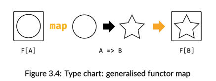

### Functors: Generalizing the map function

## Definition of a Functor Formally:
```
a functor is a type F[A] with an operation map with type (A => B) => F[B].
The general type chart is shown in Figure 3.4.
```


## Functor Laws
```
1. Identity: calling map with the identity function is the same as doing nothing:
 fa.map(a => a) == fa 
```
```
2. Composition: mapping with two functions f and g is the same as mapping with f and then mapping with g: 
  fa.map(g(f(_))) == fa.map(f).map(g)
```

#### Higher Kinds and Type Constructors Kinds are like types for types.
They describe the number of “holes” in a type.
We distinguish between regular types that have no holes and “type constructors” that have holes we can fill 
to produce types.

## Defining a Functor
```
trait Functor[F[_]]:
    extension [A](fa: F[A])
        def map[B](f: A => B): F[B]
```
usage 
```
given listFunctor: Functor[List] with
extension [A](as: List[A])
def map[B](f: A => B): List[B] =
as.map(f)
```

# Monads: Generalizing the flatMap and unit functions

## What is a Monad?

```
The name monad
We could have called Monad anything at all, like FlatMappable, Unicorn, or
Bicycle, but monad is already a perfectly good name in common use. The name
comes from category theory, a branch of mathematics that has inspired a lot of func-
tional programming concepts. The name monad is intentionally similar to monoid,
and the two concepts are related in a deep way.

Taken from: Functional Programming in Scala SE - Michael Pilquist, Rúnar Bjarnason, Paul Chiusano
```
```
This is the question that has been posed in a thousand blog posts, with ex‐
planations and analogies involving concepts as diverse as cats, Mexican food,
space suits full of toxic waste, and monoids in the category of endofunctors
(whatever that means). We’re going to solve the problem of explaining monads
once and for all by stating very simply:

A monad is a mechanism for sequencing computations.

Taken from: Scala with Cats - Copyright 2014‐20 Noel Welsh and Dave Gurnell. CC‐BY‐SA 3.0.

```

In Category theory a *monad* is a mathematical structure that captures a certain 
tpe of computation or transformation. it consists of three components:

1. A functor T: This is a type constructor that maps each object in a category
   𝐶 to another object in 𝐶, and similarly maps each morphism to another morphism.
   For example, for a monad like Option, the functor maps a type
   ```
   𝐴 to Option[A] 
   and a function 
   𝑓 : 𝐴 → 𝐵 to fmap(f): Option[A] to Option[B].
   ```
2. **A unit (or pure) natural transformation**  
   ```
    𝜂 :𝐼𝑑 ⇒ 𝑇: This maps an object A to an object in the monadic context T(A). 
   ```
   In functional programming, this is usually referred to as `pure` or `return`, taking a value and lifting it into the monadic context.

3. **A multiplication (or join) natural transformation**  
   ```
   𝜇 :𝑇^2 ⇒ 𝑇: This flattens or "joins" nested applications of the monad (i.e., fromT(T(A)) to T(A).
   ```
   In functional programming, this corresponds to flattening nested monads, like flattening an `Option[Option[A]]` into `Option[A]`.

###  Monad Laws
* Left identity: ```pure(a).flatMap(function) == function(a)```
* Right identity: ```m.flatMap(pure) == m```
* Associativity: ```m.flatMap(f).flatMap(g) == m.flatMap(x => f(x).flatMap(g))```

## Kleisli composition 

If you have a function that returns a Boolean value, you can use that Boolean value as input to a function that accepts Boolean values as input.
Generalised, if one function returns a and another function accepts a as input, you can compose these two functions:
```
(a -> b) -> (b -> c) -> (a -> c)
```
A combinator of this type takes two functions as input: a -> b (a function from a to b) and (b -> c), and returns a new function 
that 'hides' the middle step: a -> c.
```
def compose[A, B, C](f: A => F[B], g: B => F[C]): A => F[C]
```

#### Notes
- In category theory, a **morphism** is a generalization of functions in mathematics.
- **Kleisli** arrow comes from category theory and is named after the Swiss mathematician Heinrich Kleisli.
- The name **unit** is often used in mathematics to mean an identity for some operation.

## Creating a Monad
```
trait Monad[F[_]] extends Functor[F]:
    def unit[A](a: => A): F[A]
    extension [A](fa: F[A])
        def flatMap[B](f: A => F[B]): F[B]
        
        def map[B](f: A => B): F[B] = 
            flatMap(a => unit(f(a)))
        
        def map2[B, C](fb: F[B])(f: (A, B) => C): F[C] = 
            fa.flatMap(a => fb.map(b => f(a, b)))
```